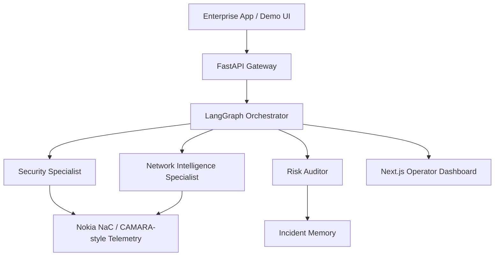

# AegisTel — Autonomous Telco-Aware AI Guard Engine

> GSMA MENA Ignite Hackathon 2026 Submission  
> Theme 7 — Open Innovation

## Executive summary

AegisTel is an autonomous fraud and risk orchestration platform that turns telecom telemetry into real-time security decisions. It combines a FastAPI backend, a LangGraph-based agent workflow, deterministic specialist reasoning, and a polished Next.js demo dashboard to make telecom-aware fraud assessment understandable, explainable, and presentation-ready.

The platform is designed for hackathon-grade demos and submission readiness. It focuses on three principles that matter for the event:

- Explainability: every decision has reasoning and an evidence trail.
- Autonomy: the system selects and executes telecom checks end to end.
- Resilience: a deterministic fallback path keeps the demo stable even when LLM providers are rate-limited.

---

## What changed in this iteration

The current version integrates the full live demo flow across backend and frontend:

- A production-style LangGraph orchestrator now drives the evaluation workflow.
- Specialist agents are part of the live reasoning path for:
  - Security Specialist
  - Network Intelligence Specialist
  - Risk Auditor
- Deterministic specialist synthesis ensures the backend remains explainable and stable even when Groq is unavailable.
- The FastAPI backend exposes a browser-friendly audit route and a live evidence trail.
- The Next.js frontend renders the verdict, telemetry, and agent trace in a polished Nokia NaC-style operator experience.
- Memory-based incident recall and a structured audit response are now part of the end-to-end experience.

---

## Why it matters

Traditional fraud systems rely on static application context. AegisTel brings telecom intelligence into the decision loop by using CAMARA-style signals such as:

- SIM swap detection
- Location verification
- Roaming status
- Device reachability
- QoD session handling

This allows the platform to make fast, evidence-backed decisions for high-value or high-risk flows such as fintech transfers, emergency dispatch, and smart city safety events.

---

## Solution architecture



### Core components

- Backend: Python, FastAPI, LangGraph, Pydantic
- Agent reasoning: deterministic specialist synthesis + optional Groq-based planning
- Frontend: Next.js, TypeScript, Tailwind-inspired UI, live evidence presentation
- Memory: incident recall for fraud pattern correlation

---

## Demo workflow

1. The user submits a transaction request with MSISDN, amount, location, and QoD preference.
2. The orchestrator selects the relevant telecom checks.
3. Tool outputs are normalized into specialist assessments.
4. The system returns a structured result: status, risk score, reasoning, recommendation, and evidence trail.
5. The UI displays the verdict and the live trace for the operator.

### Example demo scenario

A sample number such as +99999991000 triggers the expected high-risk signals in the sandbox path, including:

- recent SIM swap evidence
- failed location verification
- roaming context
- QoD step-up recommendation

---

## Project structure

```text
aegistel-mena-ignite/
├── backend/
│   ├── app/
│   │   ├── agents/
│   │   │   ├── crew_specialists.py
│   │   │   ├── graph_orchestrator.py
│   │   │   ├── memory_agent.py
│   │   │   └── tools.py
│   │   ├── api/
│   │   │   └── websocket_router.py
│   │   ├── core/
│   │   │   └── config.py
│   │   ├── schemas/
│   │   │   └── telemetry.py
│   │   └── main.py
│   └── tests/
│       └── test_orchestrator.py
├── frontend/
│   └── src/app
├── docker-compose.yml
├── generate_audio.py
├── generate_doc.py
├── generate_ppt.py
└── README.md
```

---

## Local development

### Prerequisites

- Docker and Docker Compose
- Python 3.12+
- Node.js 18+

### Backend

```bash
cd backend
python -m venv venv
source venv/bin/activate
pip install -r requirements.txt
PYTHONPATH=. uvicorn app.main:app --reload
```

### Frontend

```bash
cd frontend
npm install
npm run dev
```

### Docker

```bash
docker-compose up --build -d
```

### Useful URLs

- Frontend dashboard: http://localhost:3000
- FastAPI docs: http://localhost:8000/docs
- WebSocket route: ws://localhost:8000/ws/orchestrate

---

## Verification status

The current implementation has been validated with fresh checks:

- Backend regression tests: 4 passed
- Frontend production build: completed successfully

---

## Use cases

### Fintech security

- Fraud prevention
- Secure transaction approval
- Telecom-backed transaction assurance

### Emergency services

- Guaranteed QoS for critical communications
- Low-latency dispatch workflows
- Reliable operator coordination

### Smart cities and pilgrimage

- Crowd-aware routing
- Public safety automation
- Telecom-contextual decisioning

---

## Security and trust

AegisTel emphasizes explainable decisioning and operator transparency:

- SIM swap detection
- Location verification
- Roaming awareness
- Reachability checks
- QoD-assisted escalation
- Structured evidence trails

---

## Team

**Yahia Abdeldjalil**  
Lead AI Systems & Telecom Infrastructure Engineer

---

## License

Hackathon submission for GSMA MENA Ignite 2026.
# 📜 License

Hackathon Submission — GSMA MENA Ignite 2026.

For demonstration and evaluation purposes.