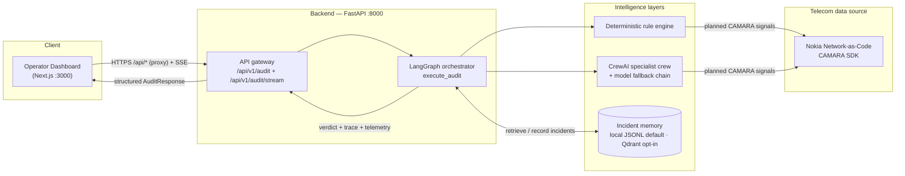
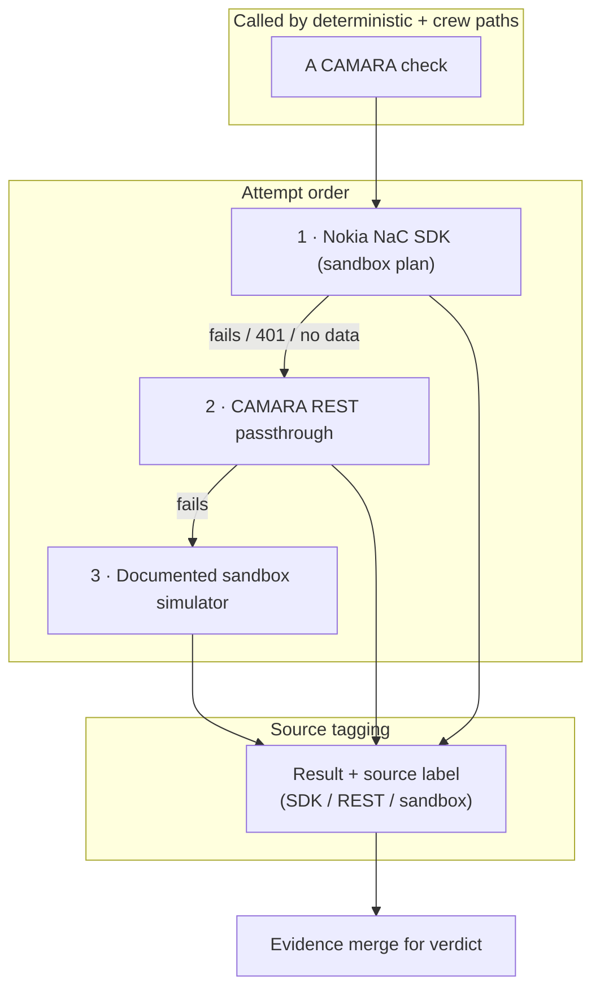
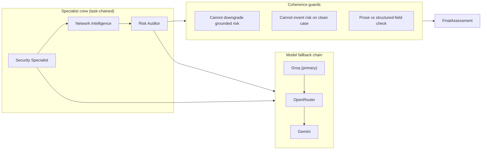
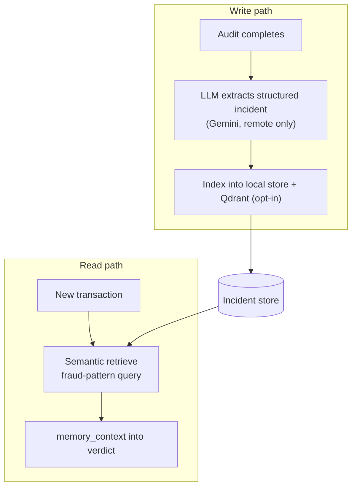
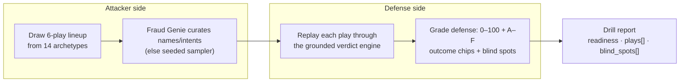

# AegisTel — stopping payment fraud & account takeover at the radio network

> GSMA MENA Ignite 2026 Hackathon · Theme 4 — Secure Fintech, Payments & Anti-Fraud Innovation

## What it does

Every MENA payment starts with a phone number. AegisTel asks the network, in a couple of seconds: *is this SIM and device really the account holder's, right now?*

The backend is FastAPI driven by a LangGraph streaming layer. A small **planner** picks the CAMARA checks a transaction actually needs, then runs them against the **Nokia NaC sandbox** (SDK → REST → documented fallback, every result stamped with its real source). A deterministic rule engine turns the evidence into a grounded verdict, and a **CrewAI specialist crew** may only make it stricter — never invent or soften risk. The verdict, plus a full per-tool evidence trail, lands on a Next.js operator dashboard that streams the whole pipeline live.

Three principles keep the build honest:

- **Explainability** — every verdict carries reasoning and an inspectable tool-by-tool trail.
- **Autonomy** — the telecom checks run end to end with no human in the loop.
- **Resilience** — a deterministic rule engine and a multi-provider model chain keep the demo standing even when live LLM/quota paths fail.

## Why this exists

Fraud teams spend most of their time on app-layer context — password, device, banking session — which an attacker who owns the SIM already holds. The missing piece is what the *telco* knows: was the SIM swapped recently, is the device where the bank believes it is, does the number binding still hold, is the serving cell congested enough to bury a swap?

| Signal | What it catches |
|---|---|
| SIM swap | Account takeover via recent SIM replacement |
| Number verification | Silent ownership / device-binding check (ATO) |
| Location verification | Device-at-claimed-location proof |
| Roaming status | Cross-border / mule-ware context |
| Device reachability | Is the device on / reachable? |
| Congestion insights | Mass-event noise that masks fraud signals |
| Quality on Demand (QoD) | Guaranteed-QoS escalation on confirmed risk |

These map straight onto **MENA mobile-first payments** — instant transfers, cross-border wires, top-ups, P2P — where the phone *is* the credential and SIM-swap/ATO fraud is the number-one settlement risk.

## System architecture



A few call-outs:

- The **deterministic rule engine is the contract** — the LLM can't silently water down the grounded verdict.
- The **CrewAI crew may only intensify confirmed risk**, never invent it on a clean case (`_reconcile_crew_output` enforces this).
- A **model fallback chain** (Groq → OpenRouter → Gemini) plus a wall-clock budget means one provider outage never collapses an audit.

## 1. Audit pipeline (backend)

```mermaid
flowchart LR
    subgraph INPUT["Request"]
        REQ["POST /api/v1/audit<br/>or /audit/stream (SSE)"]
    end

    subgraph PREP["Preparation"]
        MEM["Retrieve incident memory<br/>(skipped for simulator numbers)"]
        CTX["Build request context<br/>MSISDN · amount · location · type"]
    end

    subgraph EVID["Evidence (parallel)"]
        subgraph TOOLS["8 CAMARA tool catalog — NaC SDK → REST → sandbox (per-signal provenance)"]
            T1["SIM swap"]
            T2["Device swap"]
            T3["Location"]
            T4["Roaming"]
            T5["Reachability"]
            T6["Number verify"]
            T7["Congestion"]
            T8["QoD"]
        end
        DET["Deterministic synthesis<br/>grounded verdict + recommended action"]
    end

    subgraph LLM["LLM refinement (budget-bounded)"]
        CREW["CrewAI: security → network → auditor"]
        REC["Reconcile: floor / ceiling / prose guard"]
    end

    subgraph OUT["Response"]
        FINAL["FinalAssessment"]
        STORE["Record incident to memory"]
    end

    REQ --> MEM --> CTX
    CTX --> TOOLS
    TOOLS --> DET
    DET --> CREW
    CREW --> REC
    REC --> FINAL
    FINAL --> STORE
    FINAL --> RESP["AuditResponse<br/>status · risk · reasoning · trace"]
```



A bounded policy fixes the mandatory identity evidence; the planner then picks optional signals from a strict allowlist. `plan_tool_calls` defines the non-negotiable safety envelope per transaction type — a required check can't be dropped, and the agent can't invent an API call. The chosen tools run **concurrently** as `asyncio` calls and rejoin before the deterministic synthesis (drawn as a single edge into the tool box to keep the diagram readable).

## 2. Telecom tool layer (fallback strategy)



Every result carries its **source tag**, which drives the per-request **confidence score** (`_compute_confidence`): more live-SDK results → higher confidence. The sandbox numbers `+99999991000`…`+99999991003`, `+9999123456` let the demo run fully offline while still exercising every tool.

## 3. Crew + coherence guard



- **Floor** — the LLM may tighten `STEP_UP_REQUIRED` to `REJECTED`/`BLOCKED`, but may never relax it to `APPROVED`.
- **Ceiling** — a clean deterministic `APPROVED` stays `APPROVED` regardless of model output.
- Every LLM stage runs under a **wall-clock budget**; on timeout the chain degrades to the deterministic fallback instead of hanging the request.

## 4. Incident memory



- Default store is **local JSONL** (`data/local_memory.jsonl`, override with `AEGISTEL_MEMORY_PATH`) — no network dependency, deterministic across runs.
- With `AEGISTEL_LIVE_MEMORY=1` (default in the repo `.env`), every incident and feedback record is **also mirrored to Qdrant** (`aegistel_audit_history`, `aegistel_feedback`). Reads merge local + Qdrant and de-duplicate, so a restart on wiped storage still restores full audit history and feedback. If the cluster is unreachable, everything degrades silently to the local store.
- Every audit is recorded (powering the operator's History / risk-trend panel), but **simulator subscribers are excluded from verdict weighting**, so the clean control case (`+99999991001`) stays honestly `APPROVED` across repeated demo runs.

## 5. Adversarial drill (red team)



The drill flips the same multi-agent engine into the attacker. Every run rotates **structural blind spots** (sub-threshold first strikes, mid-size QoD-provisioned transfers, medium-congestion windows), so the red team usually finds a genuine weakness — while the control play never manufactures risk.

## Demo workflow

1. The operator submits a transaction (MSISDN, amount, location, QoD preference).
2. The dashboard opens a **live SSE stream** (`POST /api/v1/audit/stream`); each CAMARA tool animates in as it returns (source + latency), then the deterministic synthesis, the LLM layer, and the verdict.
3. The orchestrator returns status, risk, reasoning, recommendation, and a full evidence trail — every tool payload is inspectable in the Evidence Explorer.
4. The operator can flip to **Red Team** and run the Adversarial Drill against the same crew.

`+99999991000` triggers the expected high-risk sandbox profile (recent SIM swap, failed Number Verification, high congestion, failed location, roaming, QoD step-up) — the same drama the `otp-sim-swap` / `cross-border-mule` / `congestion-strike` drill archetypes exercise.

## API overview

| Method | Endpoint | Purpose |
|---|---|---|
| `GET` | `/api/health` | Liveness + count of active tools (`active_tool_count: 9`) |
| `POST` | `/api/v1/audit` | One-shot audit → `AuditResponse` |
| `POST` | `/api/v1/audit/stream` | SSE pipeline progress → verdict |
| `GET` | `/api/v1/history/{msisdn}` | Recorded audit history for a number |
| `POST` | `/api/v1/drill/run` | Run the Adversarial Drill |
| `POST` | `/api/audio/tts` | TTS narration (Deepgram only; `503` + hint when unconfigured) |
| `POST` | `/api/memory/clear-all` | Reset the incident store (operator-only, needs `AEGISTEL_ADMIN_KEY`) |
| `POST` | `/api/feedback` | Submit visitor feedback (≥1 star rating per feature; public) |
| `GET` | `/api/feedback` | Founder-only readback (needs `AEGISTEL_ADMIN_KEY`; `401`/`503` otherwise) |
| `POST` | `/api/copilot/chat` | Copilot Q&A over the platform FAQ (`enhance: true` adds LLM polish) |

## Project structure

```text
aegistel-mena-ignite/
├── backend/
│   ├── app/
│   │   ├── agents/
│   │   │   ├── tools.py               # 9 CAMARA tools + SDK/REST/sandbox fallback
│   │   │   ├── crew_specialists.py    # CrewAI crew + deterministic engine + reconcile
│   │   │   ├── graph_orchestrator.py  # LangGraph orchestration (execute_audit)
│   │   │   ├── drill_agent.py         # Adversarial Drill attacker/defender
│   │   │   └── memory_agent.py        # Incident memory (local JSONL · Qdrant opt-in)
│   │   ├── core/config.py             # env-driven settings
│   │   ├── schemas/telemetry.py       # Pydantic request/response models
│   │   └── main.py                    # FastAPI app + routes
│   ├── tests/                         # 165 test functions (offline, network-free)
│   └── requirements.txt
├── frontend/
│   └── src/app/
│       ├── components/{AuditFlowDiagram,CopilotWidget,FeedbackWidget}.tsx
│       ├── globals.css / layout.tsx / page.tsx / privacy/
├── Dockerfile.hf        # single-container build (HF Spaces / Render)
├── docker-compose.yml   # two-service local stack
├── render.yaml          # Render blueprint (also picked up by .github/ keepalive)
├── start.sh
├── LOCAL_E2E_TEST.md    # the full run + verify guide (one-shot curl battery + UI scenarios)
└── DEPLOYMENTS.md       # deployment options + env vars
```

## Running & testing

For the full picture (every API check, the frontend scenarios, secrets needed) see **[LOCAL_E2E_TEST.md](LOCAL_E2E_TEST.md)** and **[DEPLOYMENTS.md](DEPLOYMENTS.md)**. The essentials:

> **Reviewers/judges:** AegisTel needs **provider API keys you create yourself** (free tiers are fine) — they are never committed. Copy `.env.example` to `.env` and fill the keys. Minimum for a live verdict: one LLM key and `GOOGLE_API_KEY`; the `QDRANT_URL` + `QDRANT_API_KEY` pair enables the durable audit-history/feedback mirror when `AEGISTEL_LIVE_MEMORY=1`.

```bash
# Local: backend (:8000) + frontend (:3000)
cd backend && uvicorn app.main:app --reload
cd frontend && npm install && npm run dev

# Two-service Docker stack
docker compose up --build -d

# Single container (HF Spaces / Render)
docker build -f Dockerfile.hf -t aegistel . && docker run -p 7860:7860 aegistel

# Free always-on demo for judges (no credit card):
#   render.com → New → Blueprint → this repo (uses render.yaml, Dockerfile.hf)
#   → https://aegistel.onrender.com, kept warm by a GitHub Actions cron
#   (see DEPLOYMENTS.md §4 for secrets + the AEGISTEL_URL keepalive variable)

# Offline suite — 191 passed / 1 skipped, no live keys needed
cd backend && ../venv/bin/python -m pytest tests/ -q

# Live behavioral eval (needs real model keys)
cd backend && ../venv/bin/python -m pytest tests/test_behavioral_eval.py --run-live
```

## Verification status

- **Backend:** 165 test functions, offline and network-free — 191 passed, 1 skipped (the SDK is stubbed, LLM keys are blanked so the deterministic crew fallback runs, the Qdrant mirror is force-disabled, and memory is redirected to a scratch file). The live behavioral eval is opt-in via `--run-live`.
- **Frontend:** typecheck + lint clean.
- **Judge-path:** `docker compose up --build -d` boots both services; an audit through the frontend proxy returns HTTP 200 with all tools and a grounded verdict. Local, `Dockerfile.hf`, and Render all reach the backend through the same `AEGISTEL_BACKEND_URL` wiring.
- **Live LLM E2E (verified):** real audit completed with `used_fallback: false`, memory initialized, Deepgram TTS working. The deterministic-only path is <5 s (p50 0.57–1.02 s on the NAC sandbox, ~0.01 s pure offline); the LLM-enhanced path is currently inline (~69 s worst observed) — the client's deterministic retry recovers the verdict if the live stream drops.

## Evaluation & coherence

The behavioral eval gate (`backend/tests/test_behavioral_eval.py`) runs fixed scenarios against both the deterministic engine and the LLM-augmented workflow:

- **Deterministic-only: 10/10** matched the expected verdict.
- **LLM-augmented strictness: 10/10** — never more lenient than the deterministic contract.
- **LLM-augmented exact agreement: 5/10** — the other 5 were the LLM choosing a *stricter* outcome on confirmed risk, which is the intended augmentation.
- Benign cases (`+99999991001`, sub-threshold amounts) always agree exactly with deterministic `APPROVED`.

> **Live caveat:** the free tiers used by the demo (Groq `gpt-oss` ~8000 TPM, Gemini embeddings, CAMARA sandbox) can transiently run out of quota. Those are treated as retryable rate-limit conditions: the crew cooldowns the affected model, walks the fallback chain, and finally lands on the deterministic contract — so the eval stays coherent, never lenient, under quota pressure.

The reconcile layer enforces: the LLM may **intensify** confirmed risk, **cannot downgrade** grounded risk, and **cannot invent** risk on a clean case — so the same transaction yields the same verdict whether the LLM path is active or not. Memory escalates clean-but-previously-flagged cases and bumps active risk one severity level. QoD provisioning is a **recommendation-only operator action** (`qod_recommended`), never a side effect of the audit — the chargeable Nokia QoD session is created only through the authenticated, policy-gated `POST /api/v1/audit/qod/provision` confirm endpoint, which checks the freshness and tenant-scope of the `audit_id`.

## Business model

**Buyer:** MENA banks, digital wallets, remittance platforms, mobile-money/insurtech that authorize payments, plus the mobile operators holding the radio-network signals.

**Model:** a **fraud-decision API priced per protected transaction** — a metered, fail-closed call returning an evidence-backed verdict before money settles. Indicative pricing `~$0.01–0.05` per graded transaction with volume tiers. Rate the verdict, not the feature: a single stopped ATO wire repays years of API fees. The operator is the data holder and revenue owner, reselling CAMARA signals to financial institutions (the way SIM-swap verification is already sold at scale today).

For the pitch framing, see `docs/submission/THEME4_PITCH.md`.

## Security & production readiness — honest status

This is a **hackathon demonstration**, not a payment-grade product. What's real today versus what production adoption would still need:

| Control | Demo status | Production requirement |
|---|---|---|
| Telemetry integrity | Tool `success` flags derived from `status_code < 400` + no error; regression-tested | Keep + attest (e.g. signed receipts) |
| Rate limiting | In-process sliding window per IP (`AEGISTEL_API_RATE_LIMIT_PER_MIN`) on audit/stream/feedback/copilot/TTS/drill → `429` + `Retry-After` | Edge/WAF + authenticated per-tenant quotas |
| Operator auth | `AEGISTEL_ADMIN_KEY` (Bearer / `X-Admin-Token` / `?token=`) on history, memory-wipe, provider probe, feedback readback; fails closed `401`/`503` | OIDC/SSO, roles, credential rotation, audit logs |
| Tenant isolation | Tenant namespace **derived server-side** from the credential; `AuditRequest` has **no tenant field** (`extra="forbid"`); anonymous callers scoped to `AEGISTEL_DEFAULT_TENANT` (or `401`) | Per-tenant stores, sign-ups, compliance, key rotation |
| QoD consent | Risk surfaced as `qod_recommended` only; the decision never calls Nokia QoD. The session is created **only** via `POST /v1/audit/qod/provision`, gated by `AEGISTEL_QOD_POLICY_ENABLED`, a tenant/demo key, a fresh recommended `audit_id`, rate-limited and one-time per audit | Carrier billing integration, explicit subscriber opt-in |
| CAMARA access | **Nokia NaC sandbox** — SDK → REST → documented fallback, per-signal source labels; a 401 entitlement gap or unknown E.164 degrades honestly (UNKNOWN) | Carrier-grade SLAs, egress IP allow-lists, per-capability entitlements |
| Voice | Deepgram-only TTS, fails closed | Vendor contract, regional latency |

**Privacy:** purpose, minimization, retention, deletion, operator access, and the synthetic-demo-data statement are documented in [`PRIVACY.md`](./PRIVACY.md) and rendered at `/privacy`.

## Use cases

- **MENA mobile-first payments** — stop account takeover and SIM-swap fraud at the radio network, before settlement.
- **Instant & cross-border wires** — catch mule-ware (SIM-staging, roaming context, geo-fence breaks) on same-day payments.
- **Fintech / neobank screening** — phone-backed assurance and QoD step-up for high-value transfers app-layer screens can't see.

## Team

**Yahia Abdeldjalil** — Lead AI Systems & Telecom Infrastructure Engineer

## License

Hackathon submission for GSMA MENA Ignite 2026 — demonstration and evaluation purposes.