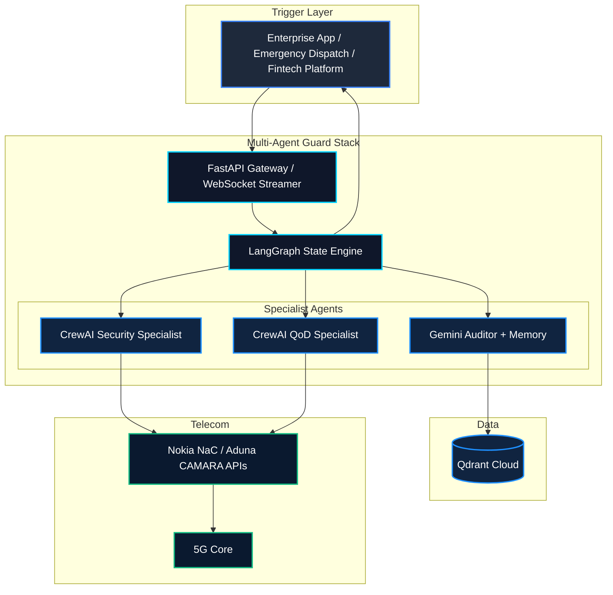
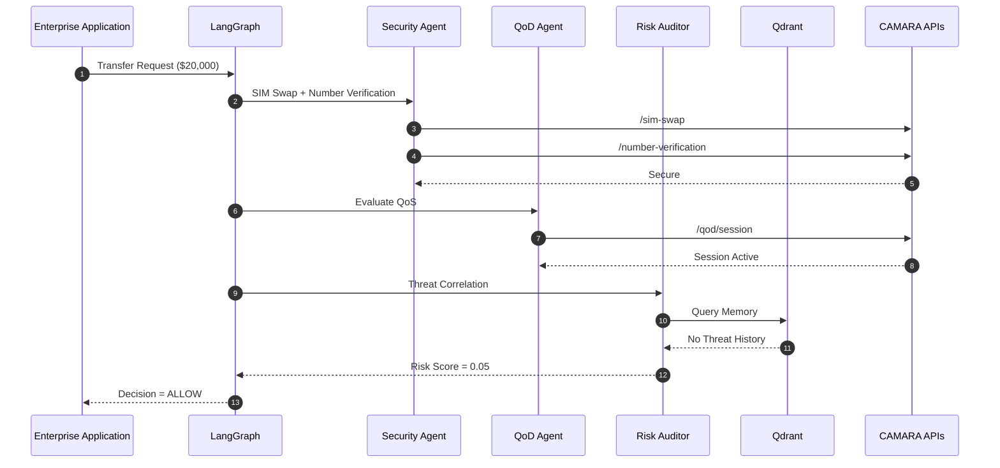

# AegisTel (GSMA MENA Ignite Hackathon)
# 🛡️ AegisTel — Autonomous Telco-Aware AI Guard Engine

> **GSMA MENA Ignite Hackathon 2026 Submission**
>
> **Selected Theme:** Theme 7 — Open Innovation *(Cross-cutting: Fintech Security, Smart Cities & Pilgrimage / Emergency Services)*

---

# 📌 Executive Summary

**AegisTel** is an autonomous, event-driven AI middleware engine that bridges enterprise application logic with programmable 5G core networks through **GSMA CAMARA Open Gateway APIs**.

Rather than treating telecommunications infrastructure as a passive transport layer, AegisTel transforms it into an intelligent security and orchestration platform capable of making autonomous policy decisions in real time.

The platform ingests high-level enterprise events—such as:

- 💳 Financial transfers
- 🚑 Emergency dispatch requests
- 🏙️ Smart city congestion alerts
- 🔐 Identity verification requests

It then coordinates multiple AI agents using **LangGraph** and **CrewAI** to:

- analyze risk,
- query telecom network intelligence,
- execute CAMARA APIs,
- and produce an explainable decision:

- ✅ **ALLOW**
- ❌ **BLOCK**
- ⚠️ **ESCALATE**

---

# 💡 Key Innovation

Traditional enterprise security relies on:

- SMS OTP authentication
- Static network provisioning
- Manual telecom integrations
- Siloed fraud detection

AegisTel replaces these with an **autonomous telecom-aware reasoning engine** capable of dynamically chaining multiple GSMA CAMARA APIs through:

- Nokia Network-as-Code (NaC)
- Aduna Global Platform

This enables applications to make decisions based on **live telecommunications intelligence** rather than static application data.

---

# 🏗️ System Architecture



---

# 🛠️ Integrated GSMA CAMARA APIs

| CAMARA API | Purpose | AI Agent Action |
|------------|---------|-----------------|
| **SIM Swap Detection** | Detects recent SIM swaps | Prevent account takeover before approving transactions |
| **Number Verification** | Silent carrier verification | Eliminates insecure SMS OTP authentication |
| **Quality on Demand (QoD)** | Dynamic 5G QoS provisioning | Creates dedicated low-latency slices for mission-critical traffic |
| **Location Verification** | Cell-based geofence validation | Confirms physical presence of the requesting device |
| **Congestion Insights** | Live cellular congestion monitoring | Supports smart city routing and crowd management |
| **Device Reachability** | Connectivity & roaming status | Verifies device availability before policy execution |

---

# ⚡ Multi-Agent Orchestration



---

# 🤖 AI Stack

## LangGraph

Responsible for:

- Stateful workflow execution
- Branching logic
- Parallel agent coordination
- Failure recovery
- Decision orchestration

---

## CrewAI

Provides specialized autonomous agents:

- Security Specialist
- QoD Specialist
- Risk Auditor

Each agent has independent:

- goals
- tools
- prompts
- responsibilities

---

## Groq (Llama-3.3-70B)

Used for:

- ultra-low latency reasoning
- CAMARA API selection
- telecom decision making
- tool calling

---

## Gemini 2.5 Pro

Responsible for:

- contextual reasoning
- audit generation
- policy explanation
- threat correlation

---

## Mem0 + Qdrant Cloud

Persistent long-term memory storing:

- historical fraud attempts
- telecom events
- security incidents
- previous policy decisions

---

# 📂 Project Structure

```text
aegistel-mena-ignite/
│
├── backend/
│   ├── app/
│   │
│   ├── agents/
│   │   ├── state.py
│   │   ├── crew_specialists.py
│   │   ├── memory_agent.py
│   │   └── graph_orchestrator.py
│   │
│   ├── api/
│   │   └── websocket_router.py
│   │
│   ├── core/
│   │   └── config.py
│   │
│   ├── services/
│   │   ├── aduna_service.py
│   │   └── nac_service.py
│   │
│   └── main.py
│
├── frontend/
│
├── docker-compose.yml
├── Dockerfile
├── requirements.txt
│
├── generate_doc.py
├── generate_ppt.py
│
└── README.md
```

---

# 🚀 Quick Start

## Prerequisites

- Docker
- Docker Compose
- Python 3.12+
- Node.js 18+

---

## 1. Configure Environment

Create:

```text
backend/.env
```

```env
GROQ_API_KEY=your_groq_api_key

GOOGLE_API_KEY=your_gemini_api_key

QDRANT_URL=https://your-cluster.qdrant.tech
QDRANT_API_KEY=your_qdrant_api_key

ADUNA_API_KEY=your_aduna_api_key

NOKIA_NAC_API_KEY=your_nokia_nac_key
```

---

## 2. Launch

```bash
docker-compose up --build -d
```

---

## Available Services

| Service | URL |
|----------|-----|
| Frontend Dashboard | http://localhost:3000 |
| FastAPI Documentation | http://localhost:8000/docs |
| WebSocket Trace | ws://localhost:8000/ws/orchestrate |

---

# 🎯 Example Workflow

1. Enterprise application sends a transaction request.

2. LangGraph starts the orchestration pipeline.

3. Security Agent checks:

   - SIM Swap
   - Number Verification

4. QoD Agent provisions a dedicated 5G session if necessary.

5. Auditor queries historical memory.

6. Risk score is computed.

7. Final decision is returned:

- ✅ Allow
- ❌ Block
- ⚠️ Escalate

---

# 🌍 Example Use Cases

### 💳 Fintech

- Fraud prevention
- Secure transaction approval
- Silent user verification

---

### 🚑 Emergency Services

- Guaranteed QoS
- Low-latency dispatch
- Reliable responder communications

---

### 🕌 Pilgrimage & Smart Cities

- Crowd density monitoring
- Intelligent routing
- Public safety automation

---

### 🏢 Enterprise Security

- Telecom-aware Zero Trust
- Network intelligence
- Device verification

---

# 🔒 Security Features

- SIM Swap Detection
- Silent Number Verification
- Telecom Identity Validation
- AI Risk Scoring
- Persistent Threat Memory
- Explainable Decisions
- Event Audit Trails
- WebSocket Live Execution Trace

---

# 👨‍💻 Team

**Yahia Abdeldjalil**

Lead AI Systems & Telecom Infrastructure Engineer

📧 Email: **yahia@aegistel.ai**

---

# 📦 Repository

```
github.com/yahiaongh/aegistel-mena-ignite
```

---

# 📜 License

Hackathon Submission — GSMA MENA Ignite 2026.

For demonstration and evaluation purposes.