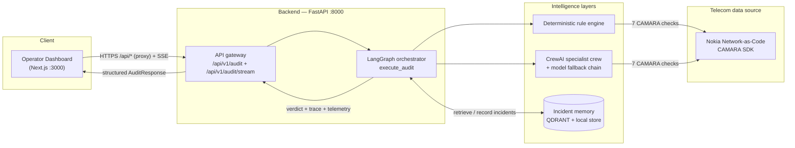
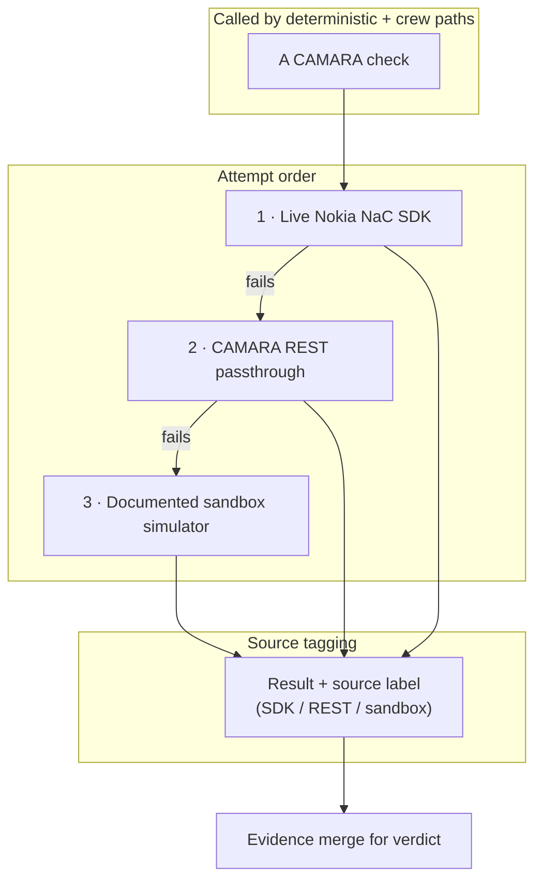
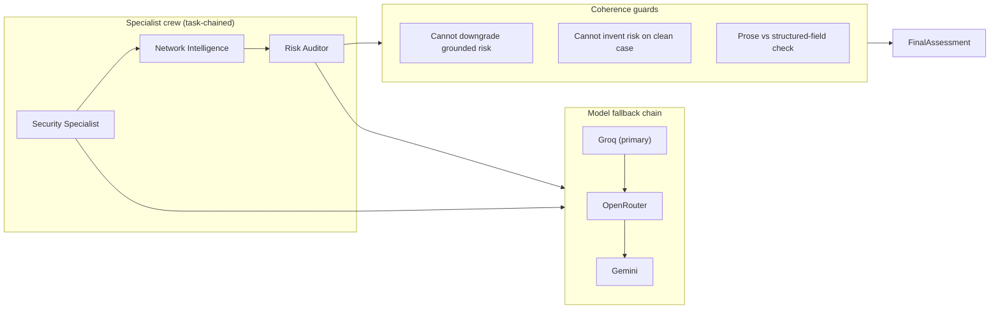
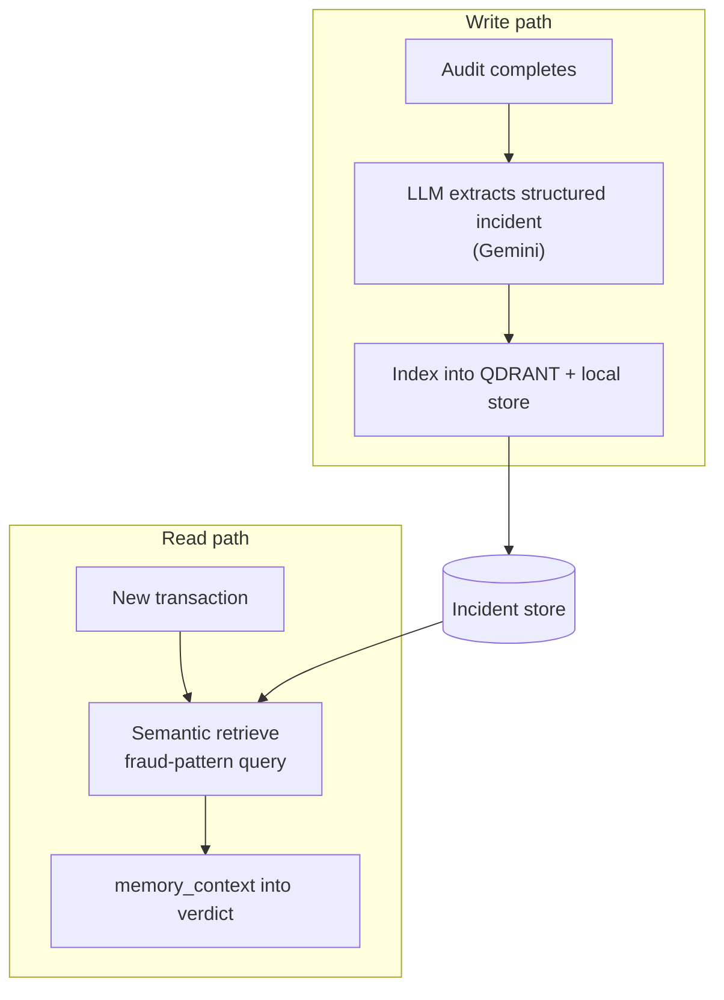
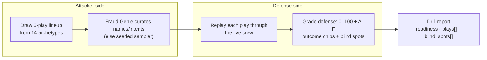

# AegisTel — Autonomous Telco-Aware AI Guard Engine

> GSMA MENA Ignite Hackathon 2026 Submission · Theme 7 — Open Innovation

## Executive summary

AegisTel turns a single transaction context (MSISDN, amount, location, QoD
preference) into an **explainable, autonomous fraud decision**. The backend is a
FastAPI service driven by a LangGraph orchestrator: it runs **seven live CAMARA
telecom checks** through the Nokia Network-as-Code SDK, fuses the evidence with a
deterministic rule engine, lets a **CrewAI specialist crew** refine the verdict
(made stricter only when warranted), and returns a grounded decision with a full
evidence trail. A polished Next.js dashboard renders the live pipeline and the
operator-facing verdict.

The design rests on three principles:

- **Explainability** — every decision carries reasoning and an inspectable tool-by-tool evidence trail.
- **Autonomy** — telecom checks execute end to end with no human in the loop.
- **Resilience** — a deterministic rule engine and a multi-provider model chain keep the demo stable even when live LLM/quota paths fail.

---

## Why it matters

Traditional fraud systems evaluate a transaction against static application
context. AegisTel injects **operator-grade telecom intelligence** into the
decision loop — the same signals a telco uses to protect its own subscribers —
so the verdict reflects where the device really is, whether the SIM was recently
replaced, whether the number binding still holds, and how congested the serving
cell is.

| Signal | What it detects |
|---|---|
| SIM swap | Account-takeover via recent SIM replacement |
| Number Verification | Silent ownership / device-binding check (account takeover) |
| Location verification | Device-at-claimed-location proof |
| Roaming status | Cross-border / roaming context |
| Device reachability | Is the device ON / reachable? |
| Congestion Insights | Crowd-gathering / mass-event context |
| Quality on Demand (QoD) | Guaranteed-QoS escalation on confirmed risk |

These apply directly to **fintech transfers, emergency dispatch, and smart-city
/ pilgrimage safety** — any flow where a fast, evidence-backed decision matters.

---

## System architecture



**Key call-outs:**

- The **deterministic rule engine is the authoritative contract** — it defines
  the grounded verdict and cannot be silently downgraded by the LLM.
- The **CrewAI crew may only intensify confirmed risk**, never invent risk on a
  clean case (coherence is enforced in `crew_specialists._reconcile_crew_output`).
- A layered **model fallback chain** (Groq → OpenRouter → Gemini) plus a wall-clock
  budget means one provider outage never collapses the audit.

---

## 1. Backend — audit pipeline (data flow)

```mermaid
flowchart LR
    subgraph INPUT["Request"]
        REQ["POST /api/v1/audit<br/>or /audit/stream (SSE)"]
    end

    subgraph PREP["Preparation"]
        MEM["Retrieve incident memory<br/>(skipped for simulator numbers)"]
        CTX["Build request context<br/>MSISDN · amount · location · type"]
    end

    subgraph EVID["Evidence (parallel)"]
        subgraph TOOLS["7 CAMARA tools — SDK → REST → sandbox"]
            T1["SIM swap"]
            T2["Location"]
            T3["Roaming"]
            T4["Reachability"]
            T5["Number verify"]
            T6["Congestion"]
            T7["QoD"]
        end
        DET["Deterministic synthesis<br/>grounded verdict + recommended action"]
    end

    subgraph LLM["LLM refinement (budget-bounded)"]
        CREW["CrewAI: security → network → auditor"]
        REC["Reconcile: floor / ceiling / prose guard"]
    end

    subgraph OUT["Response"]
        FINAL["FinalAssessment"]
        STORE["Record incident to memory"]
    end

    REQ --> MEM --> CTX
    CTX --> TOOLS
    TOOLS --> DET
    DET --> CREW
    CREW --> REC
    REC --> FINAL
    FINAL --> STORE
    FINAL --> RESP["AuditResponse<br/>status · risk · reasoning · trace"]
```



The seven tools run as `asyncio` calls that execute **concurrently** and rejoin
before the deterministic synthesis — shown here as a single edge into the tool
box to keep the diagram from tangling while staying truthful to the concurrency.

---

## 2. Telecom tool layer (fallback strategy)



Each result carries its **source tag**, which drives the per-request **confidence
score** (`_compute_confidence`): more live-SDK results → higher confidence. The
sandbox simulator numbers (`+99999991000` … `+99999991003`, `+9999123456`) let the
demo run fully offline while still exercising every tool.

---

## 3. CrewAI specialist + coherence guard



- **Floor** — the LLM may turn `STEP_UP_REQUIRED` into `REJECTED`/`BLOCKED`, but it
  may never relax a grounded `STEP_UP_REQUIRED` to `APPROVED`.
- **Ceiling** — if the deterministic engine said `APPROVED` with no risk signal,
  the verdict stays `APPROVED` regardless of model output.
- Each LLM stage runs under a **wall-clock budget**; on timeout the chain degrades
  to the deterministic fallback instead of hanging the request.

---

## 4. Incident memory (data flow)



- Writes/reads use Gemini-backed extraction so they do **not** compete with the
  specialist reasoning budget; reads fall back to local exact-match for stability.
- Every audit is **recorded** (powering the operator's Audit History / risk-trend
  panel), but **simulator subscribers are excluded from verdict weighting** so the
  clean control case (`+99999991001`) stays honestly `APPROVED` across repeated
  demo sessions.

---

## 5. Adversarial Drill (red team)



The drill flips the same multi-agent engine into the attacker: every run
rotates **structural blind spots** (sub-threshold first strikes, mid-size
QoD- provisioned transfers, medium-congestion windows) so the red team finds a
genuine weakness while the control play never manufactures risk.

---

## Demo workflow

1. The operator submits a transaction (MSISDN, amount, location, QoD preference).
2. The dashboard opens a **live SSE stream** (`POST /api/v1/audit/stream`) that
   animates each CAMARA tool as it returns (source + latency), the deterministic
   synthesis, the LLM layer, and finally the verdict.
3. The orchestrator runs the telecom checks, merges evidence, refines with the
   crew, and returns status, risk score, reasoning, recommendation, and a full
   evidence trail (every tool payload is inspectable in the Evidence Explorer).
4. The operator can flip to **Red Team** and run the Adversarial Drill against the
   same crew.

A sample number like `+99999991000` triggers the expected high-risk sandbox
profile (recent SIM swap, failed Number Verification, High congestion, failed
location, roaming, QoD step-up) — the same drama the `otp-sim-swap` /
`cross-border-mule` / `congestion-strike` drill archetypes exercise.

---

## API overview

| Method | Endpoint | Purpose |
|---|---|---|
| `GET` | `/api/health` | Liveness + count of active tools (`active_tool_count: 7`) |
| `POST` | `/api/v1/audit` | One-shot audit → `AuditResponse` |
| `POST` | `/api/v1/audit/stream` | SSE pipeline progress → verdict |
| `GET` | `/api/v1/history/{msisdn}` | Recorded audit history for a number |
| `POST` | `/api/v1/drill/run` | Run the Adversarial Drill |
| `POST` | `/api/audio/tts` | TTS narration (Deepgram, else edge_tts) |
| `POST` | `/api/memory/clear-all` | Reset the incident store (test/demo helper) |

`GET /api/health` returns `"active_tool_count": 7` on a configured instance;
dashboards repoll it every 20s.

---

## Project structure

```text
aegistel-mena-ignite/
├── backend/
│   ├── app/
│   │   ├── agents/
│   │   │   ├── tools.py               # 7 CAMARA tools + SDK/REST/sandbox fallback
│   │   │   ├── crew_specialists.py    # CrewAI crew + deterministic engine + reconcile
│   │   │   ├── graph_orchestrator.py  # LangGraph orchestration (execute_audit)
│   │   │   ├── drill_agent.py         # Adversarial Drill attacker/defender
│   │   │   └── memory_agent.py        # Incident memory (QDRANT + local)
│   │   ├── core/config.py             # env-driven settings
│   │   ├── schemas/telemetry.py       # Pydantic request/response models
│   │   └── main.py                    # FastAPI app + routes
│   ├── tests/                         # 90 tests (89 offline pass + 1 opt-in live)
│   │   └── test_behavioral_eval.py    # behavioral eval gate (deterministic + live LLM)
│   └── requirements.txt
├── frontend/
│   └── src/app/
│       ├── components/{AuditFlowDiagram,ThreatStream}.tsx  # live pipeline UI
│       ├── globals.css / layout.tsx / page.tsx
├── Dockerfile.hf        # single-container build (HF Spaces / Render)
├── docker-compose.yml   # two-service local stack
├── start.sh
├── RUN_AND_TEST.md      # run/test/API-key guide
└── DEPLOYMENTS.md       # deployment options + env vars
```

---

## Running & testing

For full, judge-ready instructions see **[RUN_AND_TEST.md](RUN_AND_TEST.md)** and
**[DEPLOYMENTS.md](DEPLOYMENTS.md)**. The essentials:

> **Heads-up for reviewers/judges:** AegisTel needs **provider API keys you create
> yourself** (free tiers are fine) — they are never committed. Before running,
> create a root `.env` from `backend/.env.example` and fill in your keys
> (minimum live verdict: an LLM key, `GOOGLE_API_KEY`, `QDRANT_URL` +
> `QDRANT_API_KEY`). See "Before you run" in RUN_AND_TEST.md.

```bash
# Local: backend (:8000) + frontend (:3000)
cd backend && uvicorn app.main:app --reload
cd frontend && npm install && npm run dev

# Two-service Docker stack
docker compose up --build -d

# Single container (HF Spaces / Render)
docker build -f Dockerfile.hf -t aegistel . && docker run -p 7860:7860 aegistel

# Offline test suite — 89 passed + 1 opt-in live test (no live keys needed)
cd backend && ../venv/bin/python -m pytest tests/ -q

# Run the live behavioral eval (needs real model keys):
cd backend && ../venv/bin/python -m pytest tests/test_behavioral_eval.py --run-live
```

---

## Verification status

- **Backend tests:** 89 passed / 0 failures, **0 warnings**, plus **1 opt-in live
  test** that skips by default (`backend/pytest.ini` filters third-party
  deprecation noise). The offline portion is fully stubbed — SDK and LLM calls are
  mocked, memory is redirected to a scratch file. Run the live behavioral eval
  with `pytest tests/test_behavioral_eval.py --run-live`.
- **Frontend:** typecheck + lint clean.
- **Judge-path simulation:** `docker compose up --build -d` boots both services;
  an audit via the frontend proxy returns HTTP 200 with all 7 tools and a grounded
  verdict. Local, `Dockerfile.hf`, and Render all reach the backend through the
  same `AEGISTEL_BACKEND_URL` wiring.
- **Live LLM E2E (verified):** real audit in ~69s with `used_fallback: false`,
  memory initialized, and TTS returning audio (Deepgram → edge_tts fallback).

---

## Evaluation & coherence

The behavioral eval gate (`backend/tests/test_behavioral_eval.py`) runs 10 fixed
scenarios against the deterministic engine and the LLM-augmented workflow. It is
an opt-in live test (`pytest -q tests/test_behavioral_eval.py --run-live`) —
the LLM-augmented half needs real model keys, while its deterministic-only
helpers also run in the normal offline suite:

- **Deterministic-only: 10/10** matched the expected verdict.
- **LLM-augmented strictness: 10/10** — never more lenient than the deterministic contract.
- **LLM-augmented exact agreement: 5/10** — the other 5 were the LLM choosing a
  *stricter* outcome on confirmed risk (e.g. `REJECTED` instead of
  `STEP_UP_REQUIRED`), which is the intended augmentation.
- Benign cases (`+99999991001`, sub-threshold amounts) always agree exactly with
  deterministic `APPROVED`.

The reconcile layer enforces: LLM may **intensify** confirmed risk, **cannot
downgrade** grounded risk, and **cannot invent** risk on a clean case — so the
same transaction yields the same verdict whether the LLM path is active or not.
Memory context escalates clean-but-previously-flagged cases and bumps active risk
one severity level; QoD creation is a consequence of risk, not a signal.

---

## Use cases

- **Fintech security** — fraud prevention, secure transaction approval, telecom-backed assurance.
- **Emergency services** — guaranteed QoS for critical comms, low-latency dispatch, reliable operator coordination.
- **Smart cities & pilgrimage** — crowd-aware routing, public-safety automation, telecom-contextual decisioning.

---

## Team

**Yahia Abdeldjalil** — Lead AI Systems & Telecom Infrastructure Engineer

## License

Hackathon submission for GSMA MENA Ignite 2026 — for demonstration and evaluation purposes.
