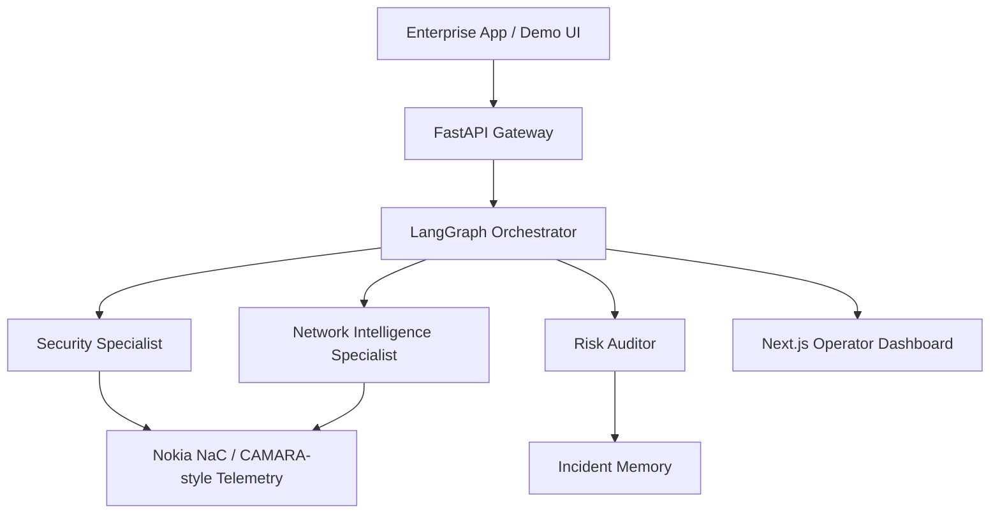

# AegisTel — Autonomous Telco-Aware AI Guard Engine

> GSMA MENA Ignite Hackathon 2026 Submission  
> Theme 7 — Open Innovation

## Executive summary

AegisTel is a telecom-aware fraud assessment demo that turns transaction context into an explainable security decision. The current backend combines a FastAPI API, a specialist workflow for SIM swap, location, roaming, reachability, and QoD checks, and a polished Next.js operator dashboard.

The implementation is designed for hackathon-grade demos and submission readiness. It focuses on three principles that matter for the event:

- Explainability: every decision has reasoning and an evidence trail.
- Autonomy: the system executes telecom checks end to end for the supplied MSISDN and transaction context.
- Resilience: a deterministic fallback path keeps the demo stable even when live LLM or CrewAI execution is unavailable.

---

## What changed in this iteration

The current version integrates the full live demo flow across backend and frontend:

- A production-style LangGraph orchestrator now drives the evaluation workflow.
- CrewAI is the primary reasoning path for the specialist agents, with deterministic synthesis remaining as the safety net when model calls fail or quotas are exhausted.
- The specialist crew now uses a layered model chain that tries Groq first, then Gemini, then OpenRouter as additional fallbacks so one provider outage does not collapse the whole workflow.
- The auditor uses its own fallback chain so the final verdict can still be produced if one provider becomes unavailable.
- The FastAPI backend exposes a browser-friendly audit route and a live evidence trail, including structured error details for failed requests.
- The Next.js frontend renders the verdict, telemetry, and agent trace in a polished Nokia NaC-style operator experience.
- Memory-based incident recall now uses Gemini-backed memory extraction so it does not compete with the specialist reasoning budget.

---

## Why it matters

Traditional fraud systems rely on static application context. AegisTel brings telecom intelligence into the decision loop by using CAMARA-style signals such as:

- SIM swap detection
- Location verification
- Roaming status
- Device reachability
- QoD session handling

This allows the platform to make fast, evidence-backed decisions for high-value or high-risk flows such as fintech transfers, emergency dispatch, and smart city safety events.

---

## Solution architecture



### Core components

- Backend: Python, FastAPI, LangGraph, Pydantic
- Agent reasoning: CrewAI as the primary reasoning path, with deterministic synthesis as the fallback when model calls fail or quotas are exhausted
- Frontend: Next.js, TypeScript, Tailwind-inspired UI, live evidence presentation
- Memory: incident recall for fraud pattern correlation. Writes use a small LLM extraction step (Gemini) to index memory records, but reads currently use a local exact-match lookup fallback for stability; full semantic recall/search was deliberately deferred to avoid runtime hangs on demo hardware.

---

## Demo workflow

1. The user submits a transaction request with MSISDN, amount, location, and QoD preference.
2. The orchestrator selects the relevant telecom checks.
3. Tool outputs are normalized into specialist assessments.
4. The system returns a structured result: status, risk score, reasoning, recommendation, and evidence trail.
5. The UI displays the verdict and the live trace for the operator.

### Example demo scenario

A sample number such as +99999991000 triggers the expected high-risk signals in the sandbox path, including:

- recent SIM swap evidence
- failed location verification
- roaming context
- QoD step-up recommendation

---

## Project structure

```text
aegistel-mena-ignite/
├── backend/
│   ├── app/
│   │   ├── agents/
│   │   │   ├── crew_specialists.py
│   │   │   ├── graph_orchestrator.py
│   │   │   ├── memory_agent.py
│   │   │   └── tools.py
│   │   ├── core/
│   │   │   └── config.py
│   │   ├── schemas/
│   │   │   └── telemetry.py
│   │   └── main.py
│   └── tests/
│       ├── conftest.py
│       ├── test_audit_route_error_detail.py
│       ├── test_crew_fallback_chain.py
│       ├── test_orchestrator.py
│       ├── test_startup_script.py
│       └── test_tts_fallback.py
├── frontend/
│   ├── src/
│   │   └── app/
│   │       ├── components/
│   │       │   └── ThreatStream.tsx
│   │       ├── globals.css
│   │       ├── layout.tsx
│   │       └── page.tsx
│   ├── package.json
│   └── README.md
├── Dockerfile.hf
├── docker-compose.yml
├── start.sh
└── README.md
```

---

## Local development

### Prerequisites

- Docker and Docker Compose
- Python 3.12+
- Node.js 18+

### Backend

```bash
cd backend
python -m venv venv
source venv/bin/activate
pip install -r requirements.txt
PYTHONPATH=. uvicorn app.main:app --reload
```

### Frontend

```bash
cd frontend
npm install
npm run dev
```

### Docker

```bash
docker-compose up --build -d
```

### Useful URLs

- Frontend dashboard: http://localhost:3000
- FastAPI docs: http://localhost:8000/docs

---

## Verification status

The current implementation has been validated with fresh checks:

- Backend regression tests: 34 passed via `cd backend && source ../venv/bin/activate && python -m pytest tests -q`
- Frontend lint: clean via `cd frontend && npm run lint`
- Frontend production build: succeeded via `cd frontend && npm run build`
- Deployment image build: completed successfully via `docker build -f Dockerfile.hf -t aegistel-hf-local .`

---

## Evaluation

The behavioral eval gate (`backend/scripts/round21_eval.py`) runs 10 fixed scenarios against the deterministic rule engine and the LLM-augmented workflow:

```bash
cd backend && source ../venv/bin/activate
PYTHONPATH=. python scripts/round21_eval.py --skip-llm    # deterministic only, no quota
PYTHONPATH=. python scripts/round21_eval.py --verbose     # full LLM-augmented run
PYTHONPATH=. python scripts/round21_eval.py --verbose --csv results.csv
```

Latest run on the stable scenario set:

- **Deterministic-only: 10/10** matched the expected verdict.
- **LLM-augmented strictness: 10/10** (never more lenient than the deterministic contract).
- **LLM-augmented exact agreement: 5/10** — the remaining 5 rows were the LLM choosing a *stricter* outcome on confirmed-risk cases (e.g. `REJECTED`/`MANUAL_REVIEW` instead of `STEP_UP_REQUIRED`), which is the intended augmentation.
- Benign cases (`+99999991001`, sub-threshold amounts) always agree exactly with deterministic `APPROVED`.

Coherence rules enforced by the reconcile layer:

- The LLM may **intensify confirmed risk** (e.g. `STEP_UP_REQUIRED` → `REJECTED`/`BLOCKED`).
- The LLM **cannot downgrade** grounded risk to a more lenient verdict.
- The LLM **cannot invent risk** on a clean case: if the deterministic engine returns `APPROVED` with no risk signal, the verdict stays `APPROVED` regardless of model output, so the same transaction yields the same verdict whether the LLM fallback path is active or not.
- Memory context and QoD session creation are corroborating signals only; they do not by themselves flip a clean verdict.

The eval runs one scenario at a time with memory cleared for isolation, so free-tier quota is the only limiting factor on the full LLM run.

---

## Multi-LLM fallback and quota strategy

AegisTel uses a deliberate multi-model fallback chain so the demo remains resilient when one provider rate limits or becomes unavailable:

- Specialist reasoning first tries Groq's primary 70B model.
- If that tier hits a quota or availability issue, the workflow falls back to the next available provider in the chain, including Gemini and OpenRouter.
- The risk auditor uses the same principle on its own path, with Gemini and other providers filling in when needed.
- Memory operations use Gemini-backed memory extraction so they do not compete with the specialist reasoning budget; reads use a local exact-match fallback for stability on demo hardware.

This separation is intentional: specialist fraud reasoning and memory extraction are treated as distinct workloads with distinct resilience strategies. The deterministic rule engine is treated as the authoritative contract; LLM augmentations may be stricter but are not allowed to silently be more lenient than grounded deterministic values.

---

## Use cases

### Fintech security

- Fraud prevention
- Secure transaction approval
- Telecom-backed transaction assurance

### Emergency services

- Guaranteed QoS for critical communications
- Low-latency dispatch workflows
- Reliable operator coordination

### Smart cities and pilgrimage

- Crowd-aware routing
- Public safety automation
- Telecom-contextual decisioning

---

## Security and trust

AegisTel emphasizes explainable decisioning and operator transparency:

- SIM swap detection
- Location verification
- Roaming awareness
- Reachability checks
- QoD-assisted escalation
- Structured evidence trails

---

## Team

**Yahia Abdeldjalil**  
Lead AI Systems & Telecom Infrastructure Engineer

---

## License

Hackathon submission for GSMA MENA Ignite 2026.
# 📜 License

Hackathon Submission — GSMA MENA Ignite 2026.

For demonstration and evaluation purposes.