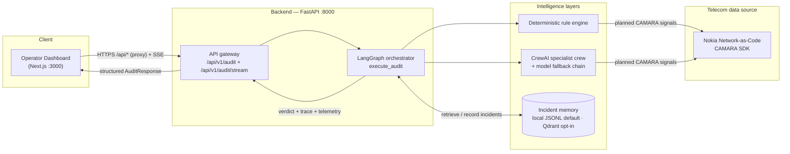
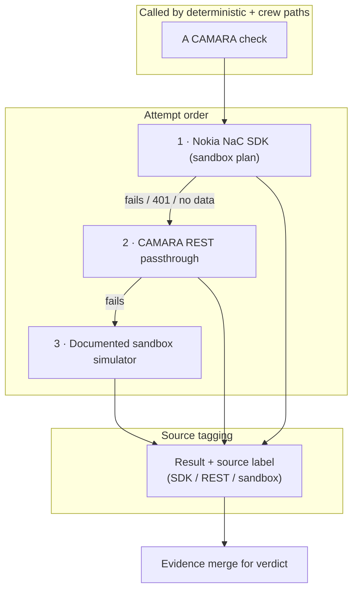
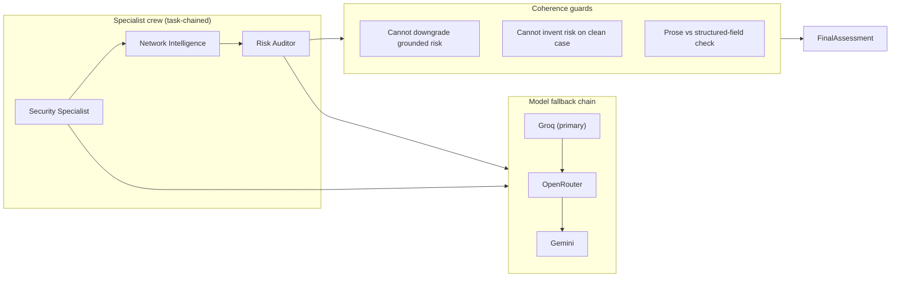
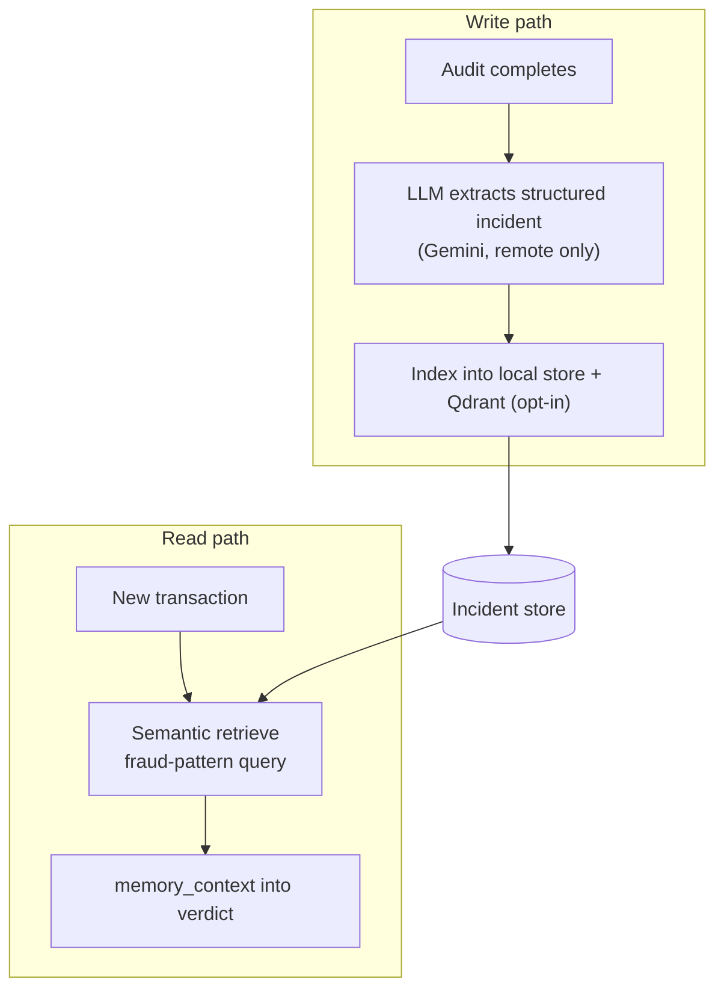
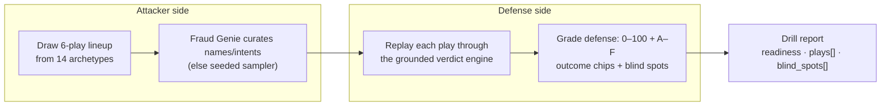

# AegisTel — Payment-Fraud & Account-Takeover Guard on the Radio Network

> GSMA MENA Ignite Hackathon 2026 Submission · Theme 4 — Secure Fintech, Payments & Anti-Fraud Innovation

## Executive summary

AegisTel answers one question per MENA payment, in seconds: *is this
SIM and device really the account holder's, right now?* The backend is a FastAPI
service driven by a LangGraph streaming wrapper: a **bounded planner** selects the
CAMARA signals the transaction actually needs, then executes **seven CAMARA
integrations through the Nokia NaC sandbox** (SDK → REST → documented sandbox
fallback, each result stamped with its real source; a 401 or unknown number
degrades provenance, never the verdict: SIM swap, number verification, location,
roaming, reachability, congestion insights, and QoD). The evidence fuses with a
deterministic rule engine, a **CrewAI specialist crew** may refine
the verdict (made stricter only when warranted), and it returns a grounded
decision with a full evidence trail — blocked or stepped-up before settlement
when the SIM was swapped, the number binding failed, or the device is not where
the bank thinks it is. A polished Next.js dashboard renders the live pipeline and
the operator-facing verdict.

The design rests on three principles:

- **Explainability** — every decision carries reasoning and an inspectable tool-by-tool evidence trail.
- **Autonomy** — telecom checks execute end to end with no human in the loop.
- **Resilience** — a deterministic rule engine and a multi-provider model chain keep the demo stable even when live LLM/quota paths fail.

---

## Why it matters

A bank's own screens verify password, device and netbanking session — but
account takeover happens **after** those gates. Traditional fraud systems keep
evaluating the same app-layer context an attacker already holds. AegisTel
injects **operator-grade telecom intelligence** into the payment decision loop —
the same signals a telco uses to protect its own subscribers — so the verdict
reflects where the device really is *right now*, whether the SIM was recently
replaced (classic ATO), whether the number binding still holds, and how
congested the serving cell is (crowd-gathering noise that buries SIM swaps).

| Signal | What it detects |
|---|---|
| SIM swap | Account-takeover via recent SIM replacement |
| Number Verification | Silent ownership / device-binding check (account takeover) |
| Location verification | Device-at-claimed-location proof |
| Roaming status | Cross-border / mule-ware context |
| Device reachability | Is the device ON / reachable? |
| Congestion Insights | Crowd-gathering / mass-event context that masks fraud signals |
| Quality on Demand (QoD) | Guaranteed-QoS escalation on confirmed risk |

These apply directly to **MENA mobile-first payments**: instant transfers,
cross-border wires, top-ups and P2P — where the phone *is* the credential and
account-takeover/SIM-swap fraud is the number-one settlement risk.

---

## System architecture



**Key call-outs:**

- The **deterministic rule engine is the authoritative contract** — it defines
  the grounded verdict and cannot be silently downgraded by the LLM.
- The **CrewAI crew may only intensify confirmed risk**, never invent risk on a
  clean case (coherence is enforced in `crew_specialists._reconcile_crew_output`).
- A layered **model fallback chain** (Groq → OpenRouter → Gemini) plus a wall-clock
  budget means one provider outage never collapses the audit.

---

## 1. Backend — audit pipeline (data flow)

```mermaid
flowchart LR
    subgraph INPUT["Request"]
        REQ["POST /api/v1/audit<br/>or /audit/stream (SSE)"]
    end

    subgraph PREP["Preparation"]
        MEM["Retrieve incident memory<br/>(skipped for simulator numbers)"]
        CTX["Build request context<br/>MSISDN · amount · location · type"]
    end

    subgraph EVID["Evidence (parallel)"]
        subgraph TOOLS["7 CAMARA tool catalog — NaC SDK → REST → sandbox (per-signal provenance)"]
            T1["SIM swap"]
            T2["Location"]
            T3["Roaming"]
            T4["Reachability"]
            T5["Number verify"]
            T6["Congestion"]
            T7["QoD"]
        end
        DET["Deterministic synthesis<br/>grounded verdict + recommended action"]
    end

    subgraph LLM["LLM refinement (budget-bounded)"]
        CREW["CrewAI: security → network → auditor"]
        REC["Reconcile: floor / ceiling / prose guard"]
    end

    subgraph OUT["Response"]
        FINAL["FinalAssessment"]
        STORE["Record incident to memory"]
    end

    REQ --> MEM --> CTX
    CTX --> TOOLS
    TOOLS --> DET
    DET --> CREW
    CREW --> REC
    REC --> FINAL
    FINAL --> STORE
    FINAL --> RESP["AuditResponse<br/>status · risk · reasoning · trace"]
```



A bounded policy establishes mandatory identity evidence; then a **CrewAI CAMARA
Orchestration Planner** chooses, per transaction context, which optional signals
to collect early from a strict allowlist. When no approved provider is available,
the trace explicitly shows the policy fallback. `crew_specialists.plan_tool_calls`
defines the non-negotiable safety envelope per transaction type, while the agent
planner cannot remove a required check or invent an API call. The policy marks a
bounded subset of the seven-tool catalog as **required** signals and defers the
rest as **optional** evidence pulled in only when the first risk scan, the
transaction value, or incident history justifies a deeper pass. The selected
tools run as `asyncio` calls that execute **concurrently** and rejoin before the
deterministic synthesis — shown here as a single edge into the tool box to keep
the diagram from tangling while staying truthful to the concurrency.

---

## 2. Telecom tool layer (fallback strategy)



Each result carries its **source tag**, which drives the per-request **confidence
score** (`_compute_confidence`): more live-SDK results → higher confidence. The
sandbox simulator numbers (`+99999991000` … `+99999991003`, `+9999123456`) let the
demo run fully offline while still exercising every tool.

---

## 3. CrewAI specialist + coherence guard



- **Floor** — the LLM may turn `STEP_UP_REQUIRED` into `REJECTED`/`BLOCKED`, but it
  may never relax a grounded `STEP_UP_REQUIRED` to `APPROVED`.
- **Ceiling** — if the deterministic engine said `APPROVED` with no risk signal,
  the verdict stays `APPROVED` regardless of model output.
- Each LLM stage runs under a **wall-clock budget**; on timeout the chain degrades
  to the deterministic fallback instead of hanging the request.

---

## 4. Incident memory (data flow)



- **Default is a local JSONL store** (`data/local_memory.jsonl`, overridable via
  `AEGISTEL_MEMORY_PATH`): no network dependency, deterministic across demo runs.
  Remote semantic memory (mem0 with Qdrant vector store + Gemini embedding) is
  built **only when the deployment opts in** with `AEGISTEL_LIVE_MEMORY=1` —
  the README/runtime do not assume a live vector cluster.
- On the opt-in remote path, extraction/embeddings are Gemini-backed so they do
  **not** compete with the specialist reasoning budget, and reads fall back to
  local exact-match for stability.
- Every audit is **recorded** (powering the operator's Audit History / risk-trend
  panel), but **simulator subscribers are excluded from verdict weighting** so the
  clean control case (`+99999991001`) stays honestly `APPROVED` across repeated
  demo sessions.

---

## 5. Adversarial Drill (red team)



The drill flips the same multi-agent engine into the attacker: every run
rotates **structural blind spots** (sub-threshold first strikes, mid-size
QoD- provisioned transfers, medium-congestion windows) so the red team finds a
genuine weakness while the control play never manufactures risk.

---

## Demo workflow

1. The operator submits a transaction (MSISDN, amount, location, QoD preference).
2. The dashboard opens a **live SSE stream** (`POST /api/v1/audit/stream`) that
   animates each CAMARA tool as it returns (source + latency), the deterministic
   synthesis, the LLM layer, and finally the verdict.
3. The orchestrator runs the telecom checks, merges evidence, refines with the
   crew, and returns status, risk score, reasoning, recommendation, and a full
   evidence trail (every tool payload is inspectable in the Evidence Explorer).
4. The operator can flip to **Red Team** and run the Adversarial Drill against the
   same crew.

A sample number like `+99999991000` triggers the expected high-risk sandbox
profile (recent SIM swap, failed Number Verification, High congestion, failed
location, roaming, QoD step-up) — the same drama the `otp-sim-swap` /
`cross-border-mule` / `congestion-strike` drill archetypes exercise.

---

## API overview

| Method | Endpoint | Purpose |
|---|---|---|
| `GET` | `/api/health` | Liveness + count of active tools (`active_tool_count: 7`) |
| `POST` | `/api/v1/audit` | One-shot audit → `AuditResponse` |
| `POST` | `/api/v1/audit/stream` | SSE pipeline progress → verdict |
| `GET` | `/api/v1/history/{msisdn}` | Recorded audit history for a number |
| `POST` | `/api/v1/drill/run` | Run the Adversarial Drill |
| `POST` | `/api/audio/tts` | TTS narration (Deepgram only; `503` + hint when unconfigured) |
| `POST` | `/api/memory/clear-all` | Reset the incident store (operator-only, needs `AEGISTEL_ADMIN_KEY`) |
| `POST` | `/api/feedback` | Submit visitor feedback (≥1 star rating per feature; public) |
| `GET` | `/api/feedback` | Founder-only readback (needs `AEGISTEL_ADMIN_KEY`; 401/503 otherwise) |
| `POST` | `/api/copilot/chat` | Copilot Q&A over the platform FAQ (`enhance: true` adds LLM polish) |

`GET /api/health` returns `"active_tool_count": 7` on a configured instance;
dashboards repoll it every 20s.

---

## Project structure

```text
aegistel-mena-ignite/
├── backend/
│   ├── app/
│   │   ├── agents/
│   │   │   ├── tools.py               # 7 CAMARA tools + SDK/REST/sandbox fallback
│   │   │   ├── crew_specialists.py    # CrewAI crew + deterministic engine + reconcile
│   │   │   ├── graph_orchestrator.py  # LangGraph orchestration (execute_audit)
│   │   │   ├── drill_agent.py         # Adversarial Drill attacker/defender
│   │   │   └── memory_agent.py        # Incident memory (local JSONL · Qdrant opt-in)
│   │   ├── core/config.py             # env-driven settings
│   │   ├── schemas/telemetry.py       # Pydantic request/response models
│   │   └── main.py                    # FastAPI app + routes
│   ├── tests/                         # 143 test functions (142 offline + 1 opt-in live)
│   │   └── test_behavioral_eval.py    # behavioral eval gate (deterministic + live LLM)
│   └── requirements.txt
├── frontend/
│   └── src/app/
│       ├── components/{AuditFlowDiagram,ThreatStream}.tsx  # live pipeline UI
│       ├── globals.css / layout.tsx / page.tsx
├── Dockerfile.hf        # single-container build (HF Spaces / Render)
├── docker-compose.yml   # two-service local stack
├── start.sh
├── RUN_AND_TEST.md      # run/test/API-key guide
└── DEPLOYMENTS.md       # deployment options + env vars
```

---

## Running & testing

For full, judge-ready instructions see **[RUN_AND_TEST.md](RUN_AND_TEST.md)** and
**[DEPLOYMENTS.md](DEPLOYMENTS.md)**. The essentials:

> **Heads-up for reviewers/judges:** AegisTel needs **provider API keys you create
> yourself** (free tiers are fine) — they are never committed. Before running,
> create a root `.env` from `backend/.env.example` and fill in your keys
> (minimum live verdict: an LLM key and `GOOGLE_API_KEY`; the optional
> `QDRANT_URL` + `QDRANT_API_KEY` only enable remote memory when
> `AEGISTEL_LIVE_MEMORY=1`, since memory defaults to the local JSONL store).

```bash
# Local: backend (:8000) + frontend (:3000)
cd backend && uvicorn app.main:app --reload
cd frontend && npm install && npm run dev

# Two-service Docker stack
docker compose up --build -d

# Single container (HF Spaces / Render)
docker build -f Dockerfile.hf -t aegistel . && docker run -p 7860:7860 aegistel

# Free always-on hosted demo for judges (no credit card):
#   render.com -> New -> Blueprint -> this repo (uses render.yaml, Dockerfile.hf)
#   -> https://aegistel.onrender.com, kept warm by a free GitHub Actions cron
#   (see DEPLOYMENTS.md §4 for secrets + the AEGISTEL_URL keepalive variable)

# Offline test suite — 142 passed + 1 opt-in live test (no live keys needed)
cd backend && ../venv/bin/python -m pytest tests/ -q

# Run the live behavioral eval (needs real model keys):
cd backend && ../venv/bin/python -m pytest tests/test_behavioral_eval.py --run-live
```

---

## Verification status

- **Backend tests:** 142 passed / 0 failures (1 third-party `DeprecationWarning`),
  plus **1 opt-in live
  test** that skips by default (`backend/pytest.ini` filters third-party
  deprecation noise). The offline portion is genuinely network-free: the SDK is
  stubbed in a conftest fixture, LLM provider keys are blanked (forcing the
  deterministic crew fallback so no live model call can hang the suite), mem0's
  live extraction is disabled, and memory is redirected to a scratch file. Run
  the live behavioral eval with `pytest tests/test_behavioral_eval.py --run-live`.
- **Frontend:** typecheck + lint clean.
- **Judge-path simulation:** `docker compose up --build -d` boots both services;
  an audit via the frontend proxy returns HTTP 200 with all 7 tools and a grounded
  verdict. Local, `Dockerfile.hf`, and Render all reach the backend through the
  same `AEGISTEL_BACKEND_URL` wiring.
- **Live LLM E2E (verified):** real audit completed with `used_fallback: false`,
  memory initialized, and TTS returning Deepgram audio. Wall-clock was ~69s —
  the LLM-enhanced path currently runs **inline** (the audit awaits the crew
  before returning), so the sub-5-second target applies to the deterministic-only
  path: p50 0.57–1.02 s (NAC sandbox, max ≤ 4.32 s) and ~0.01 s pure offline
  compute (see `docs/submission/PERFORMANCE.md`). Two-stage enrichment (verdict
  first, LLM polish async after) is a roadmap item.

---

## Evaluation & coherence

The behavioral eval gate (`backend/tests/test_behavioral_eval.py`) runs 10 fixed
scenarios against the deterministic engine and the LLM-augmented workflow. It is
an opt-in live test (`pytest -q tests/test_behavioral_eval.py --run-live`) —
the LLM-augmented half needs real model keys, while its deterministic-only
helpers also run in the normal offline suite:

- **Deterministic-only: 10/10** matched the expected verdict.
- **LLM-augmented strictness: 10/10** — never more lenient than the deterministic contract.
- **LLM-augmented exact agreement: 5/10** — the other 5 were the LLM choosing a
  *stricter* outcome on confirmed risk (e.g. `REJECTED` instead of
  `STEP_UP_REQUIRED`), which is the intended augmentation.
- Benign cases (`+99999991001`, sub-threshold amounts) always agree exactly with
  deterministic `APPROVED`.

> **Live caveat:** the free tiers used by the demo (Groq `gpt-oss-20b`/`gpt-oss-120b`
> ~8000 TPM, Gemini embeddings, CAMARA sandbox) are small, so a `--run-live` pass
> can transiently exhaust quota (e.g. Groq `413 tokens per minute` or Gemini
> `RESOURCE_EXHAUSTED`). These are classified as retryable rate-limit conditions:
> the crew cooldowns the affected model, walks the fallback chain, and finally
> lands on the deterministic contract, while memory writes degrade to the local
> store — so the eval stays coherent (never lenient) even under quota pressure.

The reconcile layer enforces: LLM may **intensify** confirmed risk, **cannot
downgrade** grounded risk, and **cannot invent** risk on a clean case — so the
same transaction yields the same verdict whether the LLM path is active or not.
Memory context escalates clean-but-previously-flagged cases and bumps active risk
one severity level; QoD provisioning is a **recommendation-only operator action**
(`qod_recommended`), never a side effect of the decision — the chargeable Nokia
QoD session is created only through the authenticated, policy-gated
`POST /api/v1/audit/qod/provision` confirm endpoint. The confirm request must
carry the fresh, tenant-scoped `audit_id` returned by the recommendation; the
server rejects a missing, foreign, stale, or non-recommended decision.

---

## The buyer & the business model

**Buyer:** MENA banks, digital wallets, remittance platforms, and mobile-money /
insurtech players that authorize payment flows, plus the mobile operators that
hold the radio-network signals.

**Model:** a **fraud-decision API priced per protected transaction** — a
metered, fail-closed API call that returns an evidence-backed verdict before the
money settles. Indicative pricing: `~$0.01–0.05` per graded transaction, with
volume tiers and a per-tenant rate plan. Rate the verdict, not the feature: a
single stopped ATO wire repays years of API fees. The operator is the data
holder and revenue owner, reselling CAMARA signals to financial institutions
(the same way SIM-swap verification is already sold at scale today).

For the framing used in the pitch, see `docs/submission/THEME4_PITCH.md`.

## Security & production readiness — honest status

The repo is a **hackathon demonstration**, not yet a payment-grade product. What
is implemented today and what production adoption would still require:

| Control | Demo status | Production requirement |
|---|---|---|
| Telemetry integrity | Tool `success` flags derived from `status_code < 400` + no error; regression-tested | Keep + attest (e.g. signed receipts) |
| Rate limiting | In-process sliding-window per IP (`AEGISTEL_API_RATE_LIMIT_PER_MIN`) on audit/stream/feedback/copilot/TTS/drill → `429` + `Retry-After` | Edge/WAF + authenticated per-tenant quotas |
| Operator authentication | `AEGISTEL_ADMIN_KEY` (Bearer / `X-Admin-Token` / `?token=`) on history, memory-wipe, provider probe, feedback readback; fails closed `401`/`503` | OIDC/SSO, roles, credential rotation, audit logs |
| Tenant isolation | Tenant namespace **derived server-side** from the client's credential (`AEGISTEL_TENANT_API_KEYS`, `tenant=key,...`); `AuditRequest` has **no tenant field** (`extra="forbid"` → a body that smuggles `tenant_id` is a 422); anonymous callers are scoped to `AEGISTEL_DEFAULT_TENANT` (or `401` when `AEGISTEL_ALLOW_ANON_AUDIT=false`); memory writes/reads + audit echo all use the derived tenant | Per-tenant stores, sign-ups, compliance, key rotation |
| QoD provisioning consent | Risk is surfaced as `qod_recommended` only; the decision never calls Nokia QoD. The chargeable session is created **only** via `POST /v1/audit/qod/provision`, gated by `AEGISTEL_QOD_POLICY_ENABLED` (default off), a tenant bearer key or demo operator key, and a fresh tenant-scoped recommended `audit_id`; it is rate-limited, one-time per audit, uses the server-owned `AEGISTEL_QOD_SERVICE_IP`, and is recorded as a `QOD_PROVISIONED` incident | Carrier billing integration, explicit subscriber opt-in |
| CAMARA access | **Nokia NaC sandbox integration** — SDK → REST → documented fallback, per-signal source labels; a 401 entitlement gap (e.g. Number Verification) or unknown E.164 degrades to the documented fallback with honest UNKNOWN semantics | Carrier-grade SLAs, egress IP allow-lists, per-capability entitlements |
| Voice | Deepgram-only TTS, fails closed; no edge-tts | Vendor contract, regional latency |

**Privacy:** telecom data purpose, minimization, retention, deletion, operator
access, and the synthetic-demo-data statement are documented in
[`PRIVACY.md`](./PRIVACY.md) and rendered at `/privacy` on the dashboard.

**Latency (honest):** the deterministic-only decision path measures **<5 s**:
p50 0.57–1.02 s on the NAC-sandbox path (real Nokia attempts → documented
fallback, max ≤ 4.32 s) and ~0.01 s as a pure offline compute floor. The
LLM-enhanced path is currently **inline** — the audit waits for the CrewAI
chain before returning (~69 s worst observed) — and the client's deterministic
retry recovers the verdict whenever the live stream is slow or drops. True
two-stage enrichment is a roadmap item (see `docs/submission/PERFORMANCE.md`).

---

## Use cases

- **MENA mobile-first payments** — stop account takeover and SIM-swap fraud at the radio network itself, before settlement.
- **Instant & cross-border wires** — catch mule-ware (SIM-staging, roaming context, geo-fence breaks) on same-day payments.
- **Fintech / neobank screening** — phone-backed assurance and QoD step-up for high-value transfers your app-layer screens cannot see.

---

## Team

**Yahia Abdeldjalil** — Lead AI Systems & Telecom Infrastructure Engineer

## License

Hackathon submission for GSMA MENA Ignite 2026 — for demonstration and evaluation purposes.
