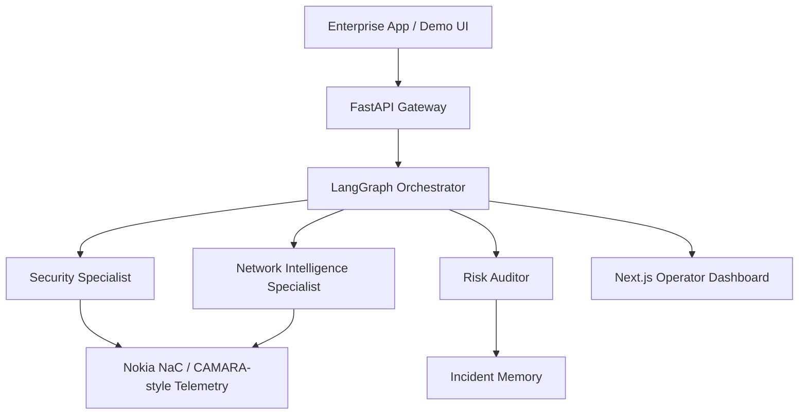

# AegisTel — Autonomous Telco-Aware AI Guard Engine

> GSMA MENA Ignite Hackathon 2026 Submission  
> Theme 7 — Open Innovation

## Executive summary

AegisTel is a telecom-aware fraud assessment demo that turns transaction context into an explainable security decision. The current backend combines a FastAPI API, a specialist workflow for SIM swap, location, roaming, reachability, and QoD checks, and a polished Next.js operator dashboard.

The implementation is designed for hackathon-grade demos and submission readiness. It focuses on three principles that matter for the event:

- Explainability: every decision has reasoning and an evidence trail.
- Autonomy: the system executes telecom checks end to end for the supplied MSISDN and transaction context.
- Resilience: a deterministic fallback path keeps the demo stable even when live LLM or CrewAI execution is unavailable.

---

## What changed in this iteration

The current version integrates the full live demo flow across backend and frontend:

- A production-style LangGraph orchestrator now drives the evaluation workflow.
- CrewAI is the primary reasoning path for the specialist agents, with deterministic synthesis remaining as the safety net when model calls fail or quotas are exhausted.
- The specialist crew now uses a layered model chain that tries Groq first, then Gemini, then OpenRouter as additional fallbacks so one provider outage does not collapse the whole workflow.
- The auditor uses its own fallback chain so the final verdict can still be produced if one provider becomes unavailable.
- The FastAPI backend exposes a browser-friendly audit route and a live evidence trail, including structured error details for failed requests.
- The Next.js frontend renders the verdict, telemetry, and agent trace in a polished Nokia NaC-style operator experience.
- The crew now executes **seven CAMARA tools** — SIM Swap, Location Verification, Device Roaming Status, Device Reachability, Quality on Demand, **Number Verification**, and **Congestion Insights** — each with a live Nokia NaC SDK call first, a CAMARA REST passthrough second, and a documented sandbox fallback third.
- Memory-based incident recall now uses Gemini-backed memory extraction so it does not compete with the specialist reasoning budget.
- Number Verification and Congestion Insights are weighted into the deterministic verdict: a FAILED/UNKNOWN number binding is an account-takeover signal on the same footing as SIM swap, while sustained High cell congestion corroborates crowd-gathering contexts.

---

## Why it matters

Traditional fraud systems rely on static application context. AegisTel brings telecom intelligence into the decision loop by using CAMARA-style signals such as:

- SIM swap detection
- Number Verification (silent ownership check)
- Location verification
- Roaming status
- Device reachability
- Congestion Insights (smart-city / crowd context)
- QoD session handling

This allows the platform to make fast, evidence-backed decisions for high-value or high-risk flows such as fintech transfers, emergency dispatch, and smart city safety events.

---

## Solution architecture



### Core components

- Backend: Python, FastAPI, LangGraph, Pydantic
- Agent reasoning: CrewAI as the primary reasoning path, with deterministic synthesis as the fallback when model calls fail or quotas are exhausted
- Frontend: Next.js, TypeScript, Tailwind-inspired UI, live evidence presentation
- Memory: incident recall for fraud pattern correlation. Writes use a small LLM extraction step (Gemini) to index memory records, but reads currently use a local exact-match lookup fallback for stability; full semantic recall/search was deliberately deferred to avoid runtime hangs on demo hardware. Every audit is recorded (powering the operator's Audit History / risk-trend panel, which serves the most recent records first), but the documented sandbox simulator subscribers (`+99999991000` … `+99999991003`, `+9999123456`) are excluded from memory-based verdict *weighting*: they are synthetic demo identities whose "history" is a demo artifact, so the clean control case (`+99999991001`) stays honestly APPROVED across repeated demo sessions.

---

## Demo workflow

1. The user submits a transaction request with MSISDN, amount, location, and QoD preference.
2. The dashboard opens a **live SSE stream** (`POST /api/v1/audit/stream`): the request/response flow diagram animates each CAMARA tool as it returns (source + latency), the deterministic synthesis, the LLM specialist/auditor layer (with the model that answered), and finally the verdict — all in real time.
3. The orchestrator selects the relevant telecom checks.
4. Tool outputs are normalized into specialist assessments.
5. The system returns a structured result: status, risk score, reasoning, recommendation, and evidence trail — every tool's raw payload is inspectable in the Evidence Explorer, alongside the LLM raw output.
6. The UI displays the verdict and the live trace for the operator.
7. **Adversarial Drill** — the operator can flip roles: the same multi-agent engine plays the attacker, executing a red-team lineup against the live crew. The attacker is dynamic: every run draws a fresh 6-play lineup from a 14-scenario arsenal (SIM-swap OTP interception, cross-border mule relays, congestion-synchronized strikes, staged micro-attacks, mid-size cash-out windows, clean control runs). When an LLM provider is available, the "Fraud Genie" curates the run's names, intents, amounts and regions; otherwise a seeded sampler rotates the arsenal — and any narration failure degrades to the sampler, so the drill never fails. The drill grades defense readiness (0-100 and A-F), surfaces the signal each play was caught on, and reports the blind spots the red team actually discovered. Three structural holes rotate between runs: sub-threshold first strikes (< $25k, clean line), mid-size transfers ($25k-$99k, clean line) where QoD is provisioned yet approval still clears, and Medium-congestion windows that carry no signal at all.

### Example demo scenario

A sample number such as +99999991000 triggers the expected high-risk signals in the sandbox path, including:

- recent SIM swap evidence
- failed Number Verification (device binding could not be confirmed)
- High cell congestion in the serving area
- failed location verification
- roaming context
- QoD step-up recommendation

Every signal above is also exercised by the drill: the `otp-sim-swap`, `cross-border-mule`, `congestion-strike` and `mule-relay` archetypes hit the exact +99999991000 profile, so the red-team panel shows the same drama as the live audit.

---

## Project structure

```text
aegistel-mena-ignite/
├── backend/
│   ├── app/
│   │   ├── agents/
│   │   │   ├── crew_specialists.py
│   │   │   ├── drill_agent.py
│   │   │   ├── graph_orchestrator.py
│   │   │   ├── memory_agent.py
│   │   │   └── tools.py
│   │   ├── core/
│   │   │   └── config.py
│   │   ├── schemas/
│   │   │   └── telemetry.py
│   │   └── main.py
│   └── tests/
│       ├── conftest.py
│       ├── test_adversarial_drill.py
│       ├── test_audit_route_error_detail.py
│       ├── test_crew_fallback_chain.py
│       ├── test_grounding_and_confidence.py
│       ├── test_number_verification_and_congestion.py
│       ├── test_orchestrator.py
│       ├── test_startup_script.py
│       └── test_tts_fallback.py
├── frontend/
│   ├── src/
│   │   └── app/
│   │       ├── components/
│   │       │   └── ThreatStream.tsx
│   │       ├── globals.css
│   │       ├── layout.tsx
│   │       └── page.tsx
│   ├── package.json
│   └── README.md
├── Dockerfile.hf
├── docker-compose.yml
├── start.sh
└── README.md
```

---

## Local development

### Prerequisites

- Docker and Docker Compose
- Python 3.12+
- Node.js 18+

### Backend

```bash
cd backend
python -m venv venv
source venv/bin/activate
pip install -r requirements.txt
PYTHONPATH=. uvicorn app.main:app --reload
```

### Frontend

```bash
cd frontend
npm install
npm run dev
```

### Docker

```bash
docker-compose up --build -d
```

### Useful URLs

- Frontend dashboard: http://localhost:3000
- FastAPI docs: http://localhost:8000/docs

---

## Verification status

The current implementation has been validated with fresh checks:

- Backend regression tests: 61 passed (`cd backend && .venv/bin/python -m pytest tests/ -q`)
- Backend drill tests: 9 passed (`cd backend && .venv/bin/python -m pytest tests/test_adversarial_drill.py -q`)
- Frontend typecheck and lint: clean (`cd frontend && npx tsc --noEmit && npm run lint`)
- API smoke: `GET /api/health` returns `"active_tool_count": 7`; `POST /api/v1/drill/run` returns a full drill report.

### How to test the Adversarial Drill

**1. Prerequisites** — backend on `:8000` (`uvicorn app.main:app --host 0.0.0.0 --port 8000 --reload` from `backend/`), frontend on `:3000` (`npm run dev` from `frontend/`; Next rewrites `/api/*` to the backend).

**2. API-level (fastest proof):**

```bash
curl http://localhost:3000/api/health                      # expect active_tool_count: 7
curl -X POST http://localhost:3000/api/v1/drill/run \
  -H "Content-Type: application/json" -d '{"use_llm": false}'   # deterministic, ~5s
```

Remove `"use_llm": false` for the full LLM crew run (plays execute concurrently; ~20-40s). Expect `readiness_score`, `grade`, `outcomes`, one entry per play in `plays[]` (verdict + risk + outcome + `detected_via` signals), and `blind_spots[]` for whatever holes this run's lineup exposed. Rerun the drill and compare — names, intents, amounts and regions change every run.

**3. UI-level (the demo):**

1. Open `http://localhost:3000` — the chip next to "APIs Integrated" must read **7 CAMARA Signals** (it re-polls every 20s; refresh the page if it was loaded before the backend started).
2. Bottom of the left column: **Red Team — Adversarial Drill** card. Click **RUN ADVERSARIAL DRILL**.
3. The button switches to "RED TEAM ENGAGED...", the Live Audit Trace shows `DRILL` events, and a voice briefing plays on completion.
4. Expected results: readiness bar + grade, outcome chips (BLOCKED / ESCALATED / PARTIALLY_MISSED / CLEARED), six play cards with threat level, defense verdict and the signals that caught each play, and an amber **Blind Spot Discovered** box (the lineups in this run, e.g. Micro-Staging First Strike and/or QoD-Provisioned Transfer) with a recommendation.
5. If a run fails, the red team card now shows the real error inline (banner) and the trace records `error` events — don't ship a "nothing happened" state.

**4. Expected numbers** (`tests/test_adversarial_drill.py` pins the deterministic behavior):

- Deterministic runs (seeded): every run has 6 plays — always a LOW clean control run (CLEARED), always ≥ 2 blind-spot-prone scenarios (PARTIALLY_MISSED), always ≥ 2 heavy-signal plays (BLOCKED / ESCALATED), and the blind-spot set rotates between runs.
- LLM runs (observed): the Fraud Genie curates fresh names/intents (e.g. "Rush Hour Robbery", "Phantom Transfer Saga"); a curated clean-sweep lineup scored 100.0 / A+ with the honest "no blind spots in this lineup" finding.
- The blind spot is different between runs — the drill must find a real weakness, the control play must never manufacture risk, and any narration failure degrades to the sampler instead of breaking the drill.

---

## Evaluation

The behavioral eval gate (`backend/scripts/round21_eval.py`) runs 10 fixed scenarios against the deterministic rule engine and the LLM-augmented workflow:

```bash
cd backend && source ../venv/bin/activate
PYTHONPATH=. python scripts/round21_eval.py --skip-llm    # deterministic only, no quota
PYTHONPATH=. python scripts/round21_eval.py --verbose     # full LLM-augmented run
PYTHONPATH=. python scripts/round21_eval.py --verbose --csv results.csv
```

Latest run on the stable scenario set:

- **Deterministic-only: 10/10** matched the expected verdict.
- **LLM-augmented strictness: 10/10** (never more lenient than the deterministic contract).
- **LLM-augmented exact agreement: 5/10** — the remaining 5 rows were the LLM choosing a *stricter* outcome on confirmed-risk cases (e.g. `REJECTED`/`MANUAL_REVIEW` instead of `STEP_UP_REQUIRED`), which is the intended augmentation.
- Benign cases (`+99999991001`, sub-threshold amounts) always agree exactly with deterministic `APPROVED`.

Coherence rules enforced by the reconcile layer:

- The LLM may **intensify confirmed risk** (e.g. `STEP_UP_REQUIRED` → `REJECTED`/`BLOCKED`).
- The LLM **cannot downgrade** grounded risk to a more lenient verdict.
- The LLM **cannot invent risk** on a clean case: if the deterministic engine returns `APPROVED` with no risk signal, the verdict stays `APPROVED` regardless of model output, so the same transaction yields the same verdict whether the LLM fallback path is active or not.
- Memory context is weighted into the verdict: a clean case with prior incident history escalates to step-up, and an already-active risk is bumped one severity level. QoD session creation is a consequence of risk, not a signal itself.

The eval runs one scenario at a time with memory cleared for isolation, so free-tier quota is the only limiting factor on the full LLM run.

---

## Multi-LLM fallback and quota strategy

AegisTel uses a deliberate multi-model fallback chain so the demo remains resilient when one provider rate limits or becomes unavailable:

- Specialist reasoning first tries Groq's primary GPT-OSS 120B model (the recommended replacement for the decommissioned `llama-3.3-70b-versatile`), with Qwen3.6-27B and GPT-OSS 20B as the Groq tiers beneath it.
- If that tier hits a quota or availability issue, the workflow falls back to the next available provider in the chain, including Gemini and OpenRouter.
- The risk auditor uses the same principle on its own path, with Gemini and other providers filling in when needed.
- Memory operations use Gemini-backed memory extraction so they do not compete with the specialist reasoning budget; reads use a local exact-match fallback for stability on demo hardware.

This separation is intentional: specialist fraud reasoning and memory extraction are treated as distinct workloads with distinct resilience strategies. The deterministic rule engine is treated as the authoritative contract; LLM augmentations may be stricter but are not allowed to silently be more lenient than grounded deterministic values.

---

## Use cases

### Fintech security

- Fraud prevention
- Secure transaction approval
- Telecom-backed transaction assurance

### Emergency services

- Guaranteed QoS for critical communications
- Low-latency dispatch workflows
- Reliable operator coordination

### Smart cities and pilgrimage

- Crowd-aware routing
- Public safety automation
- Telecom-contextual decisioning

---

## Security and trust

AegisTel emphasizes explainable decisioning and operator transparency:

- SIM swap detection
- Location verification
- Roaming awareness
- Reachability checks
- QoD-assisted escalation
- Structured evidence trails

---

## Team

**Yahia Abdeldjalil**  
Lead AI Systems & Telecom Infrastructure Engineer

---

## License

Hackathon submission for GSMA MENA Ignite 2026.
# 📜 License

Hackathon Submission — GSMA MENA Ignite 2026.

For demonstration and evaluation purposes.